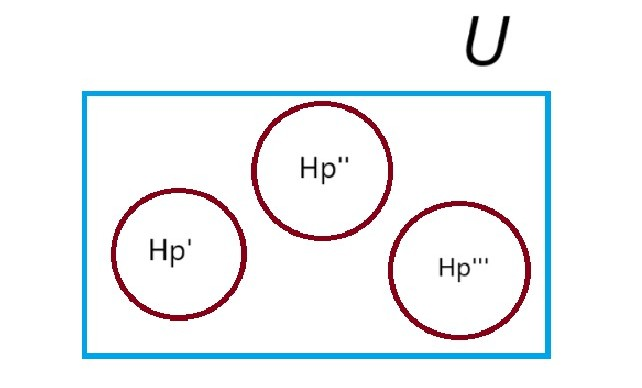
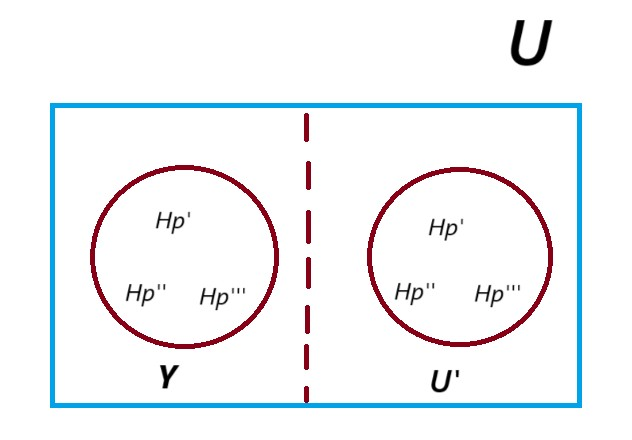

<h1>RANDOM SAMPLING OF THE ISOTOPE PARTICLES OF AN ELEMENT WITHOUT REPLACEMENT</h1>

 This problem is a <b>counting problem</b>. Whenever we're given the elements of a set, for example a set containing some fixed
    number of red, green and blue balls. We can obtain the likelihood of randomly selecting a ball of a specific colour by just
    calculating the total counts of the balls of that specific colour and dividing this sum by the total number of elements in a set.
    This approach can be expanded for any number of repeated random selections in a <b>sampling process</b>.

The project aims to make the actual random selections instead of calculating likelihoods and then studying how the
    distributions of the elements of each class, in this case a specific isotope, changes as the sampling process evolves. 
    Note that as we draw samples from a set, we will be creating subsets that form a <b>partition(s)</b> of the original set. 
    Since we will be generating two partitions from each <b>subset</b> starting from a <b>power set</b>, the data structure 
    of choice to keep track of and study the resulting partitions is a <b>binary tree</b>. That being said, let us formally
    describe the problem.

Consider a universal set U of all the particles of an element Hp. The element has 3 isotopes, Hp', Hp'',and Hp'''.
    Since U is the universal set Hp' is in U, Hp'' is  U, and Hp''' is in U. Now we can represent the universal set U
    as:
    

    
    

Now, we want to make n random picks of paraticles from U, where each pick refers to drawing a particle from the current
    set without replacement and n << m, where m represents the cardinality of the current set (for the first random pick m is
    equal to the cardinality of the universal set U). The three isotopes have varying distributions withing a set which means that
    in each set the particles of some isotopes outnumber those of others. For example one possible distribution would be 60% of particles
    belong to Hp', 30% belong to Hp'' and 10% belong to Hp'''(these values are adjustable parameters). We will place all of the n-selected
    randomly picked particles in a new set Y and the unselected particles naturally form a new set U'. Notice that Y and U' form partitions
    of the <b>power set</b> U since no particle can be in both Y and U' (we're assuming that our particles do not have a wavelength, not quantum :)
    ) and we can now represent our sets as:

 

Next, we will make n' and n'' additional random picks from our two subsets U' and Y respectively such that: 
 
 
 (n')/(m - n) = n''/(n) = m / n 
 . We will place
    all n' selected particles from subset U' and n'' selected particles from subset Y, into new subsets U'' and Y' respectively.Notice that subsets
    U', U'', Y, and Y' form partitions of powerset U. Then we will recompute the distributions of Hp', Hp'', and Hp''' in all sets U', U'',
    Y, and Y'. The next step will be to make n''' random picks from subsets U'' and Y' such that: 
 (n''')/(n'') = (n'')/(m - n) and 
    (n''')/(n'') = (n'')/n.
 This will result in four new subsets such that two will form partions of U'' and the remaining two will form partitions of Y''. We will
    keep making random picks from the new subsets using the relation between the number of random picks and the cardinality of the new subsets until we either:

  (1.) arrive at single element subsets.

  (2.) reach a pre-selected maximum number of iterations.

