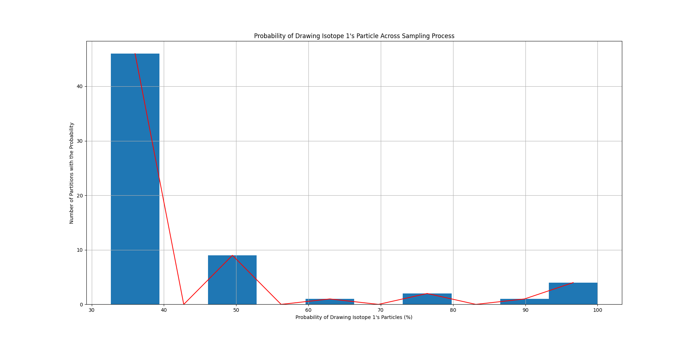

<h1>RANDOM SAMPLING OF THE ISOTOPE PARTICLES OF AN ELEMENT WITHOUT REPLACEMENT</h1>

 This problem is a <b>counting problem</b>. Whenever we're given the elements of a set, for example a set containing some fixed
    number of red, green and blue balls. We can obtain the likelihood of randomly selecting a ball of a specific colour by just
    calculating the total counts of the balls of that specific colour and dividing this sum by the total number of elements in a set.
    This approach can be expanded for any number of repeated random selections in a <b>sampling process</b>.

The project aims to make the actual random selections instead of calculating likelihoods and then studying how the
    distributions of the elements of each class, in this case a specific isotope, changes as the sampling process evolves. 
    Note that as we draw samples from a set, we will be creating subsets that form a <b>partition(s)</b> of the original set. 
    Since we will be generating two partitions from each <b>subset</b> starting from a <b>power set</b>, the data structure 
    of choice to keep track of and study the resulting partitions is a <b>binary tree</b>. That being said, let us formally
    describe the problem.

Consider a universal set U of all the particles of an element Hp. The element has 3 isotopes, Hp', Hp'',and Hp'''.
    Since U is the universal set Hp' is in U, Hp'' is  U, and Hp''' is in U. Now we can represent the universal set U
    as:
    

    
    

Now, we want to make n random picks of paraticles from U, where each pick refers to drawing a particle from the current
    set without replacement and n << m, where m represents the cardinality of the current set (for the first random pick m is
    equal to the cardinality of the universal set U). The three isotopes have varying distributions withing a set which means that
    in each set the particles of some isotopes outnumber those of others. For example one possible distribution would be 60% of particles
    belong to Hp', 30% belong to Hp'' and 10% belong to Hp'''(these values are adjustable parameters). We will place all of the n-selected
    randomly picked particles in a new set Y and the unselected particles naturally form a new set U'. Notice that Y and U' form partitions
    of the <b>power set</b> U since no particle can be in both Y and U' (we're assuming that our particles do not have a wavelength, not quantum :)
    ) and we can now represent our sets as:

 

Next, we will make n' and n'' additional random picks from our two subsets U' and Y respectively such that: 
 
 
 (n')/(m - n) = n''/(n) = n / m 
 . We will place
    all n' selected particles from subset U' and n'' selected particles from subset Y, into new subsets U'' and Y' respectively.Notice that subsets
    U', U'', Y, and Y' form partitions of powerset U. Then we will recompute the distributions of Hp', Hp'', and Hp''' in all sets U', U'',
    Y, and Y'. The next step will be to make n''' random picks from subsets U'' and Y' such that:

        
 (n''')/(n'') = (n'')/(m - n) and (n''')/(n'') = (n'')/n.

    This will result in four new subsets such that two will form partions of U'' and the remaining two will form partitions of Y''. We will
    keep making random picks from the new subsets using the relation between the number of random picks and the cardinality of the new subsets until we either:

  (1.) arrive at single element subsets.

  (2.) reach a pre-selected maximum number of iterations.

<head>
    <link rel="stylesheet" href="myStyle.css">
</head>
<body>
<h1>SIMULATION RESULTS: 50-EPOCHS VS 100-EPOCHS COMPARISON</h1>

Two simulations were run to study the impact of the number of epochs of sampling on the distribution of
    the particles from each isotope class. The total number of particles in the universal set was assigned to 
    be 1 million and each isotope represented the follow propotions: Hp' 50%, Hp'' 30%, and Hp''' 20%. At each
    sampling iteration we set the number of particles to be drawn to be 38% of the particles in the current subset that's
    being sampled. The actual particles picked are selected at random. The following results were obtained from these two
    simulations.

<h2>(A.) Number Of Partitions Generated</h2>

When we double the number of epochs, the number of partitions of the universal set generated also doubles. Of course,
    this is provided that there are enough particles in the universal set to allow every generated partition to have 
    at least 1 particle in it. We generatedd plots of the isotope tree, a binary tree displaying information about the 
    generated subsets, showing the unique ids assigned to each subset/partition as well as the distribution of the particles
    in each subset/partition.

    

    
    

    <figcaption>Figure 1: Partitions Produced for a Simulation of 50 Sampling Epochs.</figcaption>
    

    
    <figcaption>Figure 2: Partitions Produced for a Simulation of 100 Sampling Epochs.</figcaption>
    

Each of the above figures displays an isotope tree. This is simply a custom binary tree where the left and right children are
    partitions of the set represented by the parent node. In each node we can see the number of particles of each of the three Isotopes
    displayed. Traversing down the tree allows us to see how the distributions of the particles of each isotope changes as the sampling
    process evolves. In the next section we will closely examine how the distribution of isotope particles as we traverse down the tree.

<h2>(B.) Isotope Particles Distribution Along 2 Pre-Selected Paths</h2>

We will now examine how the distribution of the particles of each isotope changes as we traverse along a path. Here, path refers
    to the edges and nodes visited when traversing the tree from the root node to any leaf node. The two paths that we'll focus on are
    the leftmost path in the left-subtree and the leftmost path in the right subtree. The following figures represent these distributions of
    interest for each isotope.
    <h3>Isotope 1</h3>
    

        
        <figcaption> Figure 3: Number of Particles of Isotope One Traversing the LeftMost Path in the Left Subtree</figcaption>
    

    

    
    <figcaption> Figure 4: Number of Particles of Isotope One Traversing the LeftMost Path in the Right Subtree</figcaption>
    

    

    

    
Figure 3 and Figure 4 show that there is an exponential decrease in the particles of Isotope 1 as we traverse down the 
        isotope tree. This is not a default feature of the sampling process since its highly influenced by the number of
        particles that we've chosen to draw from each subset during a sampling iteration. This value is close to 50%. Lower
        value would definitely alter the slope of the two graphs above.
    

    

    
Figure 5 and Figure 6 contain similar plots for Isotope 2's particles.

    

        
        <figcaption>Figure 5: Number of Particles of Isotope 2 Traversing the LeftMost Path in the Left Subtree</figcaption>
    

    

        
    

    <figcaption>Figure 6: Number of Particles of Isotope 2 Traversing the LeftMost Path in the Right Subtree</figcaption>
    

    

    
Figure 7 and Figure 8 contain similar plots for Isotope 3's particles.

    

        
        <figcaption>Figure 7: Number of Particles of Isotope 3 Traversing the LeftMost Path in the Left Subtree</figcaption>
    

    

        
        <figcaption>Figure 8: Number of Particles of Isotope 3 Traversing the LeftMost Path in the Right Subtree</figcaption>
    

    

    

    
In Figure 8 the flat line portion of the graph indicates that none of Isotope 3's particles we're sampled when a new partition
        was create during the sampling process that marks the transition from partition 1 to 2. We can see that the graph recovers
        its exponentially decreasing shape in later sampling iterations.
    

<h2>(C.) Realizations of Particle Counts for Isotopes Across Sampling Process</h2>

    As the sampling process evolves the number of isotopes between two sampling iterations varies randomly. When these particle
    counts are plotted for the entire length of the simulation we obtain realizations of random processes that resemble the 
    Bernoulli Random Process. We show the plots of the obtained random processes in the following figures.
    

        
        <figcaption>Figure 9: The Instantaneous Fluctuations of the Counts of Particles for Isotope 1 Across the Simulation</figcaption>
    

    

        
        <figcaption>Figure 10: The Instantaneous Fluctuations of the Counts of Particles for Isotope 2 Across the Simulation</figcaption>
    

    

        
        <figcaption>Figure 11: The Instantaneous Fluctuations of the Counts of Particles for Isotope 3 Across the Simulation</figcaption>
    

    

    
In Figure 11 after the 48th observation the number of particles goes to 0 because there are several partitions that have no
        particles of Isotope 3 as its members. This is purely as a result of there not being enough number of particles of Isotope 3
        in the universal set to be sampled into all of the new partitions that are generated as the sampling process evolves.
    

<h2>(D.) Instantaneous Probabilities for Drawing Specific Isotope's Particles Across Simulation</h2>

One of the questions that inspired this project was "How would the probability of drawing a particular
    isotope's particles change as more partitions are generated?" We know that in the Universal set for example
    the probability of randomly drawing a particle of Isotope 1 is .5 because out of 1 million particles, half of them
    are of class Isotope 1. As we draw samples of particles randomly, these probabilities have to change, at random as well,
    the next figures show the likelihoods of drawing the particles of any isotope across all of the partitions generated from
    the sampling process.
    

        
        <figcaption>Figure 12: Probabilities of Randomly Selecting the Particles of Isotope 1 Across the Simulation</figcaption>
    

    

        
        <figcaption>Figure 13: Probabilities of Randomly Selecting the Particles of Isotope 2 Across the Simulation</figcaption>
    

    

        
        <figcaption>Figure 14: Probabilities of Randomly Selecting the Particles of Isotope 3 Across the Simulation</figcaption>
    

    

    
Figure 12 shows that the probabilities of selecting a particle of Isotope 1 are higher that those of the particles of
        Isotope 3 shown in Figure 14. This holds from the initial condition of there being more particles of Isotope 1 in the 
        universal set compared to those of Isotope 3. However, it's interesting to see that if we collect and sum the probabilities
        of sampling the particles of any Isotope across all partitions then in each case they seem to concentrate at around the value 33%.
        This was not entirely predictable before running the simulation but is still an interesting result.
    

<h2>(E.) Some Simulation Statistics</h2>

Since we're dealing with random processes it is worth exploring some statistics of this phenomena. In the following tables we show 
    the mean number of particles for each isotopes across all partitions generated in the simulation, the variance in the number of
    particles for each isotope across all partition, and the mean probabilities of radomly selecting a particle of one of the 3 isotopes (these
    mean probabilities will be used to generate Bernoulli Random Processes to compare with the realizations shown in Figures 7 - 9).
    

    
    <figcaption>Table 1: Mean Number of Particles for Each Isotope Across All Partitions</figcaption>
    

    

    

    
    <figcaption>Table 2: Variance in the Number of Particles for Each Isotope Across All Partitions</figcaption>
    

    

    

    
    <figcaption>Table 3: Mean Probabilities of Randomly Drawing Particles of An Isotope Across Simulation</figcaption>
    

    <h2>(F.) Bernoulli Random Processes</h2>
    

        The random processes generated by observing how the particles of each isotope fluctuate across the simulation
        resembles a Bernoulli random process out of all random processes. We therefore obtained the expectations of the 
        random processes in Figures 9 - 11 and use these means to generate 3 Bernoulli random processes. We show the 
        generated random processes in Figures 15 - 17.
    

    

    
    <figcaption>Figure 15: Bernoulli Random Process Generated Using the Mean Probability of Isotope 1's Random Process</figcaption>
    

    

    
    <figcaption>Figure 16: Bernoulli Random Process Generated Using the Mean Probability of Isotope 2's Random Process</figcaption>
    

    

    
    <figcaption>Figure 17: Bernoulli Random Process Generated Using the Mean Probability of Isotope 3's Random Process</figcaption>
    

The variance of the three above random processes is shown in the table below:

    
        <figcaption>Table 4: Variance in the Bernoulli Random Processes Generated from the Mean Probabilities of the Random Processes in Figures 9-11</figcaption>

</body>
